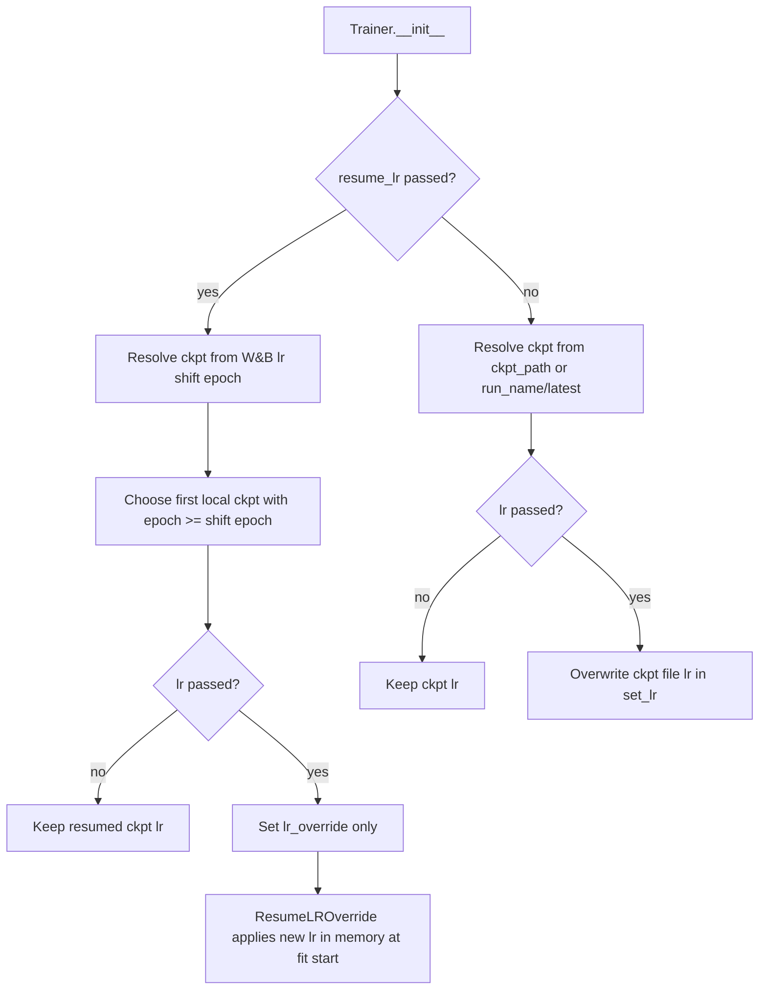

# Resume LR Flow

```mermaid
flowchart TD
    A[Trainer.__init__] --> B{resume_lr passed?}
    B -- no --> C[Resolve ckpt from ckpt_path or run_name/latest]
    B -- yes --> D[Resolve ckpt from W&B lr shift epoch]
    D --> E[Choose first local ckpt with epoch >= shift epoch]

    C --> F{lr passed?}
    E --> G{lr passed?}

    F -- no --> H[Keep ckpt lr]
    F -- yes --> I[Overwrite ckpt file lr in set_lr]

    G -- no --> J[Keep resumed ckpt lr]
    G -- yes --> K[Set lr_override only]
    K --> L[ResumeLROverride applies new lr in memory at fit start]
```
